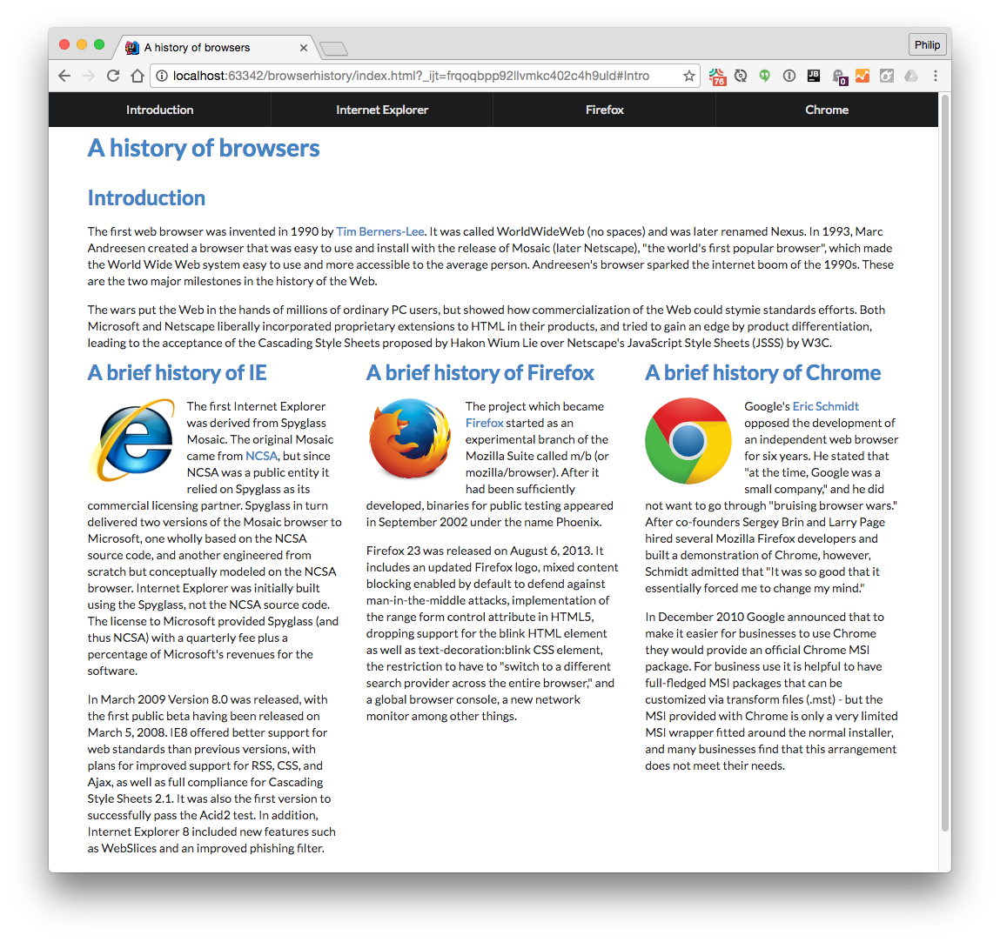

## UI Frameworks
UI Frameworks are predefined collection of classes that define and modify the behavior of elements. When programing in JavaScript, HTML, and CSS, UI Frameworks can be used to simplify the development of user interfaces. However, since learning a new framework is like learning a new programming language, starting to use UI Frameworks can be difficult. Most UI Frameworks come with predefined features and syntaxes that need to be memorized to be properly integrated into a project. Otherwise, the developer will need to a spend fair amount of time searching the framework’s documentation to understand what they are doing. There are also many different types of UI Frameworks such as Angular, Vue, and React. The UI Framework I recently begun to practice is Semantic UI.

## Semantic UI
Semantic UI is a development framework designed with simple and intuitive programming in mind. The framework comes with a lot of predefined elements such as buttons, menus, and forms. It is easy to use while still maintaining a good amount of customization. Most of the elements have a wide range of variation in color, size, and other formatting aspects. There is also the option to adjust the theme of the elements, for more advanced users. However, you can still create beautiful websites using the basic Semantic UI theme. One of Semantic UI's biggest selling points is their simplistic syntax. Semantic UI uses natural language to define classes so to create a large button you can use the “large button” class. This makes programming with Semantic UI very intuitive and easy to understand. There is still a learning curve that comes with using Semantic UI. However, compared to programming in raw HTML and CSS, the return on investment is well worth the time.

  

    <h3 class="ui header">Using Semantic UI</h3>
    
  

  

    <h3 class="ui header">Using Raw HTML & CSS</h3>
    
  

  
## Benefit
When programming in raw HTML and CSS, basic formatting can be extremely tedious. If you are not well experienced in using raw HTML and CSS, you can spend a large amount of time trying to properly format a project while still ending up with a mundane looking website. However, with Semantic UI, the  built in themes and element formatting makes building an interesting website easier and less time consuming. In the same amount of time you use to create a webpage in raw HTML and CSS, you can create more interesting looking webpage using Semantic UI. While it does take time to learn how to use Semantic UI, the simplistic natural of framework make it easy to understand and practice. Also, as a user become more experienced in HTML and CSS, they can use Semantic UI as a building block to create more complex designs. 

## Conclusion

Overall, Semantic UI and UI Frameworks in general serves to make programming is HTML and CSS a more rewarding and efficient processes. If you were to compare programming to baking brownies, you can measure all your ingredient and bake from scratch if you want to or you can buy a Betty Crocker box of brownies and make the process a lot simpler. Similarly, while you can code in raw HTML and CSS, using a UI Framework makes website development easier, more efficient, and with great results. 

