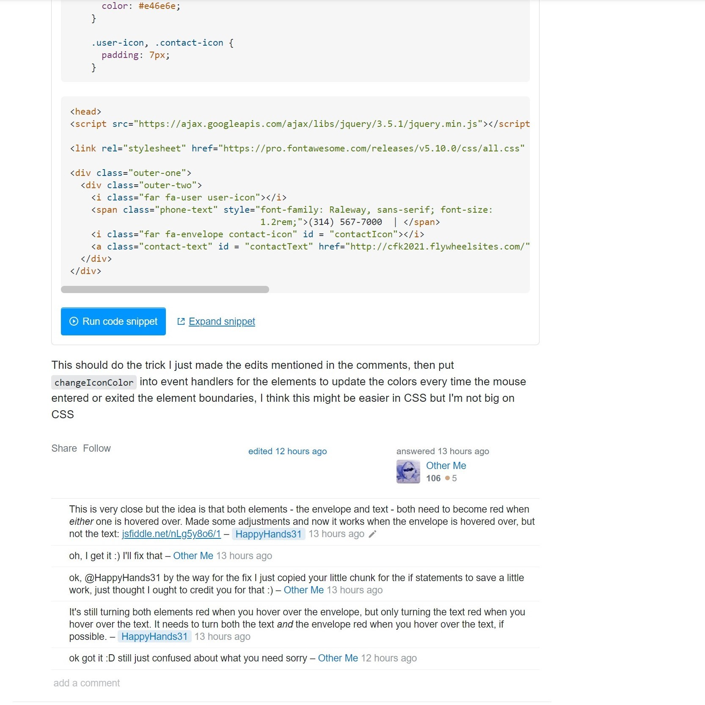

In the complex field of software engineering, you are bound to run into a situation where you will need to ask for help. However, with the sheer amount of resources available online it can be difficult to understand where and how you can ask your questions. While there is no such thing as dumb questions, there are definitely dumb ways to ask them. Especially when it is at the expense of another person. Thankfully, Eric Raymond's [*How To Ask Questions The Smart Way*](http://www.catb.org/esr/faqs/smart-questions.html) provides a comprehensive guide on when, where, and how to ask questions. 

### Why?

Ironically, at the beginning of Raymond's essay, there is a disclaimer to prevent foolish readers from asking him and the other authors technical questions unrelated to his essay. This disclaimer presents a perfect example of the importance of this topic. Learning to ask questions the smart way not only ensures that you are more likely to receive the best possible assistance but also prevents you from needlessly bothering other people and their communities. Asking questions the smart way, in the right place, and for the right reasons, will allow you to receive a better answer to your questions and it will add to the community by providing a meaningful resource for others.

### [Smart Question](https://stackoverflow.com/questions/65924975/change-color-of-icon-when-hovering-over-adjacent-text-with-jquery)

|               |               |
| ------------- | ------------- |
|||

The first step to asking a smart question to be sure that you need to ask one in the first place. In the example smart question, the asker clearly states what they are trying to do and with what tools. They also provide links to other articles they have visited. This not only shows that they have put in the effort and done their research, but it also provides a foundation for other readers who want to assist them and/or are experiencing a similar issue. The user provided their source code and a link to their jsFiddle. As a result of providing enough information and effort, the asker received help from several users and was able to converse with the community until they came to a solution. 

### [Not Smart Question](https://stackoverflow.com/questions/65931647/how-to-get-arrays-from-sting)

In this example, we see the exact opposite of a smart question. The asker in this situation, clearly, did not take the time or effort to attempt a solution. This specific question had been previously answered on *StackOverflow* and it could have been easily solved with [a single google search](https://www.google.com/search?ei=4n8TYJLoNpnA0PEPw8G3OA&q=string+to+array+javascript&oq=string+to+array+javascript&gs_lcp=CgZwc3ktYWIQAzICCAAyAggAMgIIADIGCAAQBxAeOgcIABCxAxBDOgQIABANUNBRWOxgYItmaABwAngAgAGaAYgB_g-SAQQwLjE1mAEAoAEBqgEHZ3dzLXdpesABAQ&sclient=psy-ab&ved=0ahUKEwiS4Y_RmMDuAhUZIDQIHcPgDQcQ4dUDCA0&uact=5). 

Other than the tag feature provided by *StackOverflow*, the user also did not specify what language they were coding in. Finally, to add the cherry on top, the asker did not properly format their code to match their question. An extremely generous user had to correct the provided code before answering the actual question. In this example, the asker is wasting the community's time by asking questions that have already been answered and asking questions that require more work than needed.

### Closing 

There is no such thing as a dumb question. However, there is also no excuse for laziness at the expense of others. In this day and age, there is an enormous amount of resources available online. If you find yourself needing to ask a question, please ensure that you have done the proper research first. When you do ask your question, be sure to ask it the smart way. Not only will help you get a better answer, but it may also provide a valuable resource to others who encounter similar issues. The questions you ask, in a way, reflect just as much about your experience as your work does. Being willing to put in the work and effort will be noticed by others and will yield more beneficial results as a whole.
