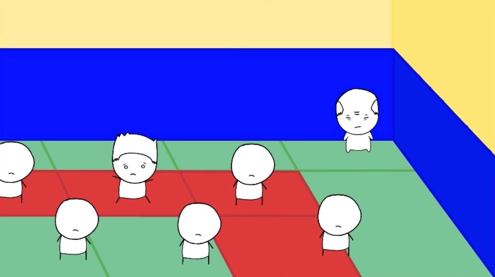
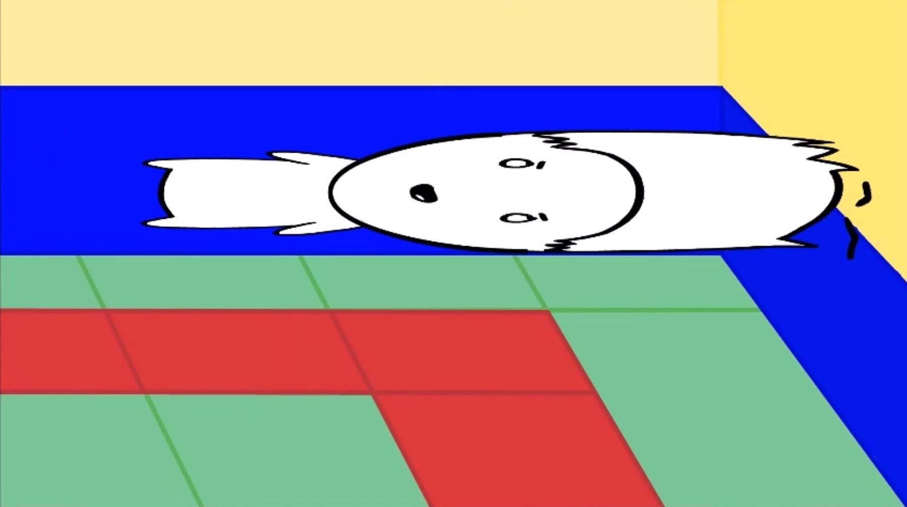
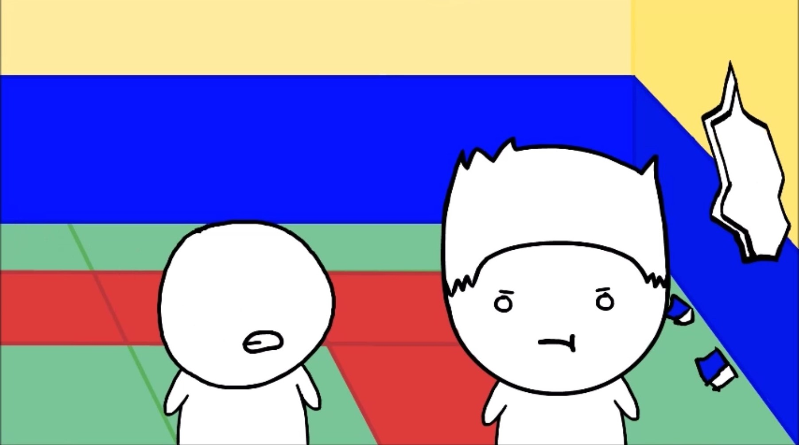

### Summary
A story of how a childhood passion, judo, brought great amounts of joy to his life despite it being a dangerous sport. The protagonist faced many injuries and hardships, such as concussions and crazy instructors, but continued to be passionate about judo to this day.

### Project Info
This animation was done during my Freshman year of college for a Digital Storytelling course. For this project, I was in charge the animation, script, sound effects, and all other aspect of the video. 

You can watch the video at [ERAU Student Works Website](https://commons.erau.edu/student-works/115/).

