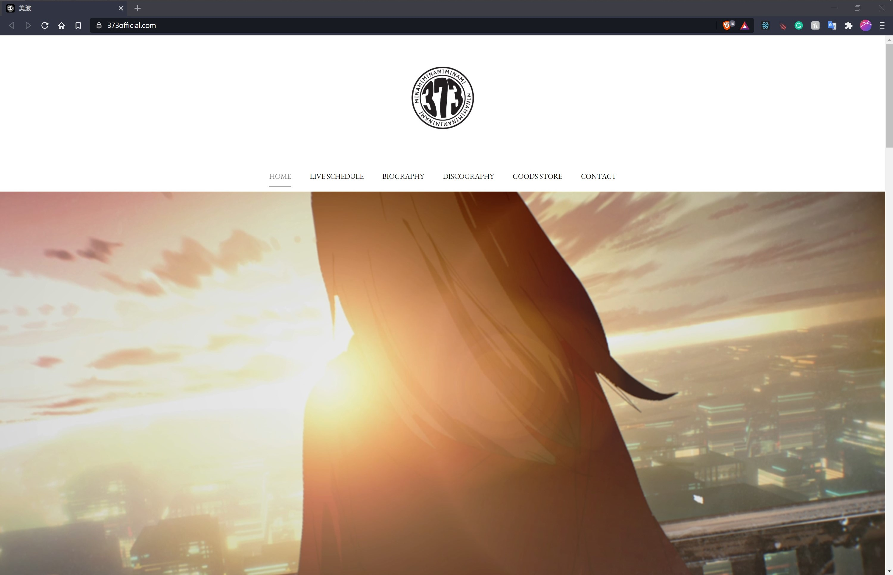
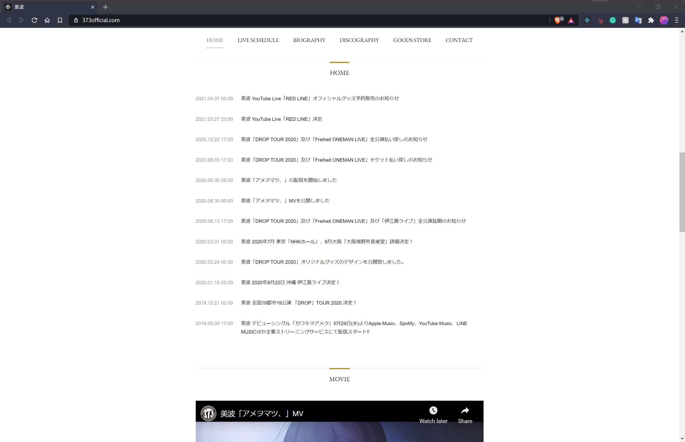
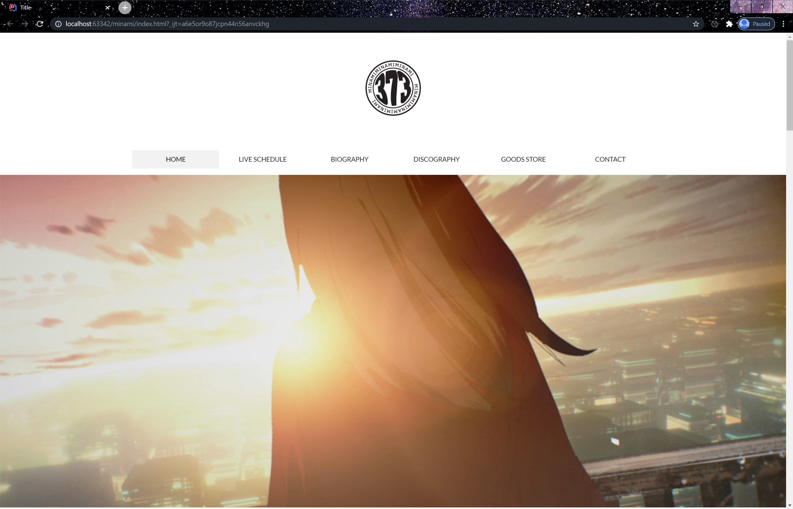
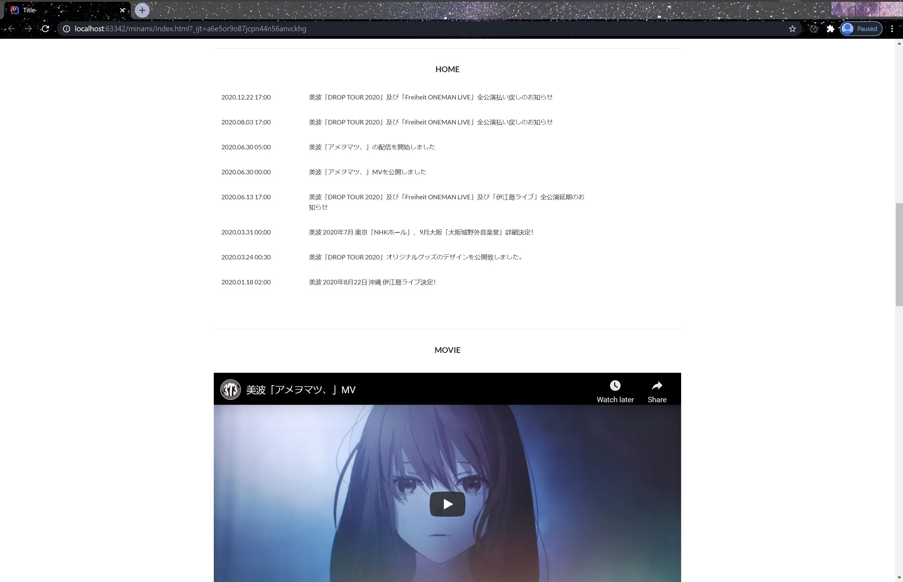
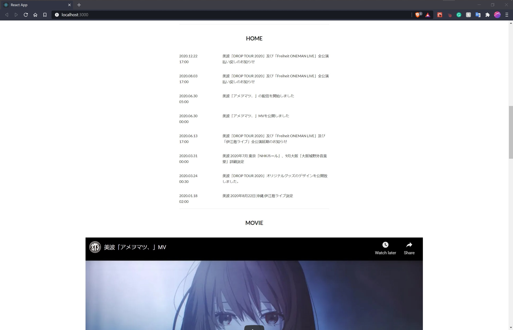

This project was a set of homework assignments for my ICS 314 course. The assignment focused on recreating a web page of my choice. The project was done using JavaScript, the Semantic UI/React Framework, and MeteorJS. The purpose of this project was to develop an understanding of the basic fundamentals of UI and web application design. I chose to recreate the homepage of the [Minami Official Website](https://www.373official.com/), a website for a popular Japanese musician.

|               |               |
| ------------- | ------------- |
| ||

### Semantic UI

For part one of this project, I recreated the webpage only using Javascript, HTML/CSS, and the Semantic UI Framework. This initial part of the assignment allowed me to implement the proper layout and design for the webpage. While this step could have been completed using raw HTML/CSS, Semantic UI's built-in themes and element formatting made the process simpler and less time-consuming. Furthermore, in the second part of this project, we used Semantic UI integration of React to improve the website design.

|               |               |
| ------------- | ------------- |
| ||

### React

Part two of this project focused on improving the code and UI design from part one. The Semantic UI integration of React allowed me to convert the standard HTML code into JSX formatting while maintaining Semantic UI's built-in themes and element formatting. This greatly simplified the development process and made the implementation of the UI design features a lot more efficient. 

|               |               |
| ------------- | ------------- |
| ||

### Meteor

Lastly, I reimplemented the webpage remake into MeteorJS. The particular project did not utilize any collections, publications, etc. However, this step served as practice for formatting code into web application framework UI components. This project taught me the basics of using UI and web application frameworks for web application development. The skills I learned from the project were essential to my growth as a software developer and served as a foundation for other projects such as my [ICS 314 Final Project]().

Source: <a href="https://github.com/micahima/minami-remake"><i class="large github icon "></i>micahima/minami-remake</a>

