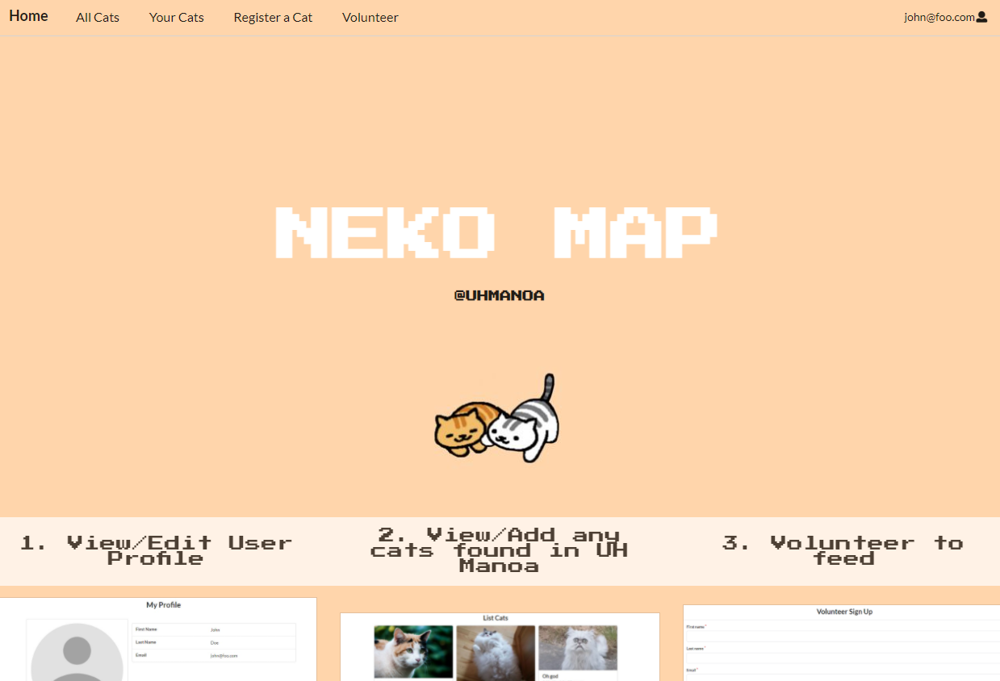
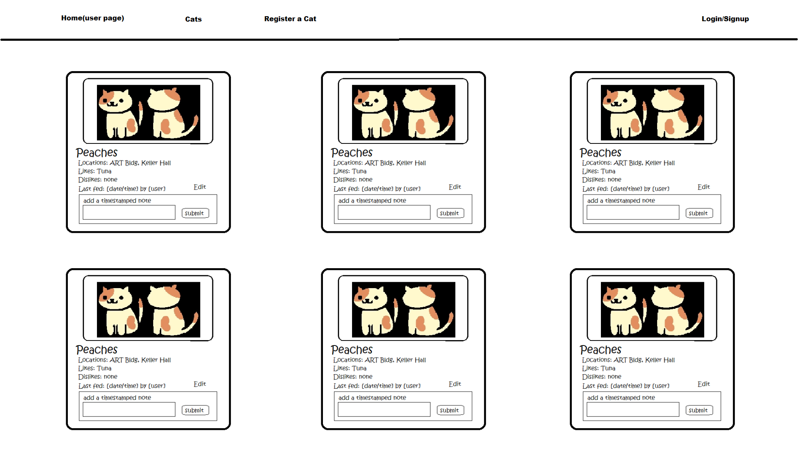
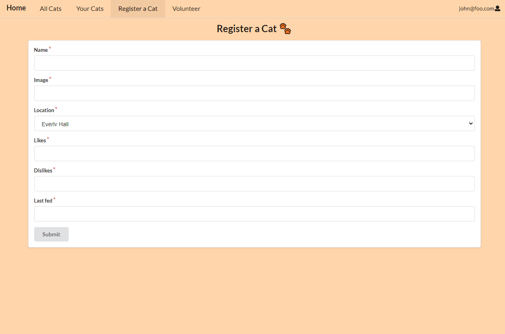

This group project was the final assignment for my ICS 314 course which I complete with my teammates, Mei Luu, Thane Luna, Nathan Corpuz. The final project focused on utilizing all of the software engineering skills we learned to develop an web application. In addition to the technical skills required to make a web applicaiton, the project also emphaized project managament, team managament, and proper documentation. For this project, my group developed an application that allows students share, track, and create profiles for stray cats around our college campus. Futher information about the project can be found on the [Neko Map Project Homepage](https://neko-map.github.io/).

### Contributions

My intial contribution to the project involved the deployment of the [Neko Map Project Homepage](https://neko-map.github.io/) and mocking up the cat profile pages. After the planning stage of our web application was complete, I focused on the development of both the volunteer and cat profile registration forms. This included the development the UI design and the integreation of a MongoDB database to collect information from the forms. In the final stage of the project, I worked on the edit feature for the cat profiles, the last minute inclusive of a public cat profile page, and the final corrections to the overall design and funcitonality of the web applciaiton. 

|               |               |
| ------------- | ------------- |
| ||

All the technical software engineering skills I learned this semester were used in this project. However, the non-technical skills were also essentinal to the success of the project. Especially during this time of social distancing, effective communication and project organization was something my group felt we needed to constantly maintain. While most of the technical skills for this project could have been practiced independently, the ability to successfuly work with a team is an important aspect of software engineering. This final project did a great job of highlight both the technical and non-technical aspect software engineering.

Final Result: <a href="https://neko-map.xyz/#/"><image src="/neko-map/neko-cat-icon.ico">neko-map.xyz</a>
Source: <a href="https://github.com/neko-map"><i class="large github icon "></i>github.com/neko-map</a>
