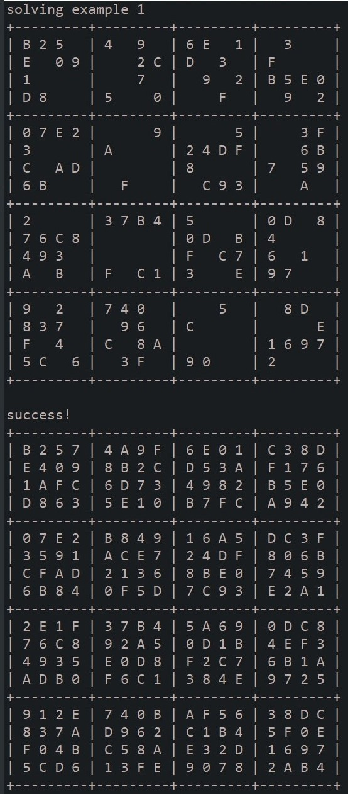

This project was a homework assignment for my ICS 211 course. The assignment focused on implementing a recusive backtracking algorithm in order to solve 16x16 Hexadecimal Sudoku Puzzles. A majority of the set-up for this project was done by the professor for the course. The students were tasked with implementing the *solveSudoku* and *legalValues* functions in *HexadecimalSudoku.java*. 

### How It Works
The *solveSudoku* function works by checking an inputted 16x16 puzzle for an empty cell which is marked by a -1. Once a empty cell is located, the *solveSudoku* function creates a list of legal values, using the *legalValue* function. The *solveSudoku* function then inputs that first legal value into the empty cell and recursivly calls itself with the newly updated puzzle as it's input.

*solveSudoku* will continute to fill empty cells with legal values until it either solves the puzzle or it encounters an empty cell with no legal values. If a cell with no legal values is encountered, the function will backtrack to the previous empty cell it encountered and try the next legal value. *solveSudoku* will continue to do this until the puzzle is solve or the last legal value of the first empty cell is used. At this point, the program decides that the inputted puzzle is unsolvable.

The program can handle the simpler sudoku problems very well and solves the depicted examples (example 1 and example 2) is a few seconds. However, the implemented algorithm can run for significantly longer depending on the puzzle. For example, the program took about 25 mins to solve the Hard puzzle. This may be due to factors than the efficeny of the program because, oddly, the program was able to solve the Harder/Impossible example is about 5 mins.

Source: <a href="https://github.com/micahima/sudokusolver"><i class="large github icon "></i>micahima/sudokusolver</a>

