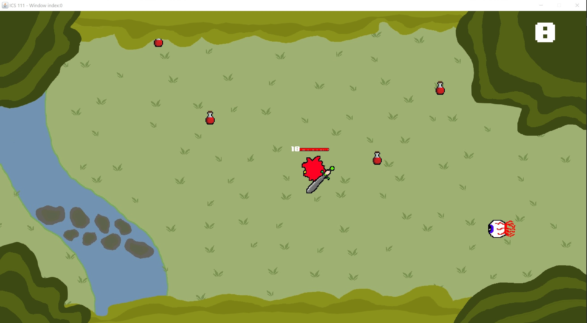

For ICS 111, Introduction to Computer Science I, I worked in a group of threee to developed a top-down game using object-oriented programming in Java. The game is implemented using the [EZ Graphic multimedia library](http://www2.hawaii.edu/~dylank/ics111/), developed by Dylan Kobayashi, for the game mechanics, user-interface, and animation.

For this project, I was the lead programmer for the mechanics and animation of the playable character. I contributed to the development of all other aspects of the game such as, the NPC mechanics, sprite design, background design, etc.

The development of this Top-Down Game served as an introduction to computer science, game development, and the Java programming language. From this project, I gain experince in object-oriented programming, GUI development, class library utilization, and team project development. 

Source: <a href="https://github.com/micahima/topdowngame-ics111"><i class="large github icon "></i>micahima/topdowngame-ics111</a>

